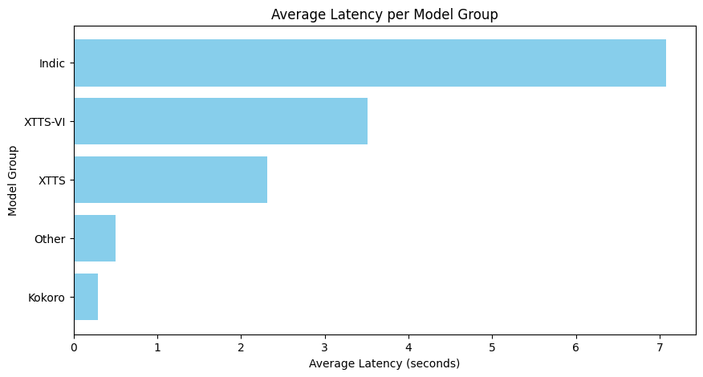
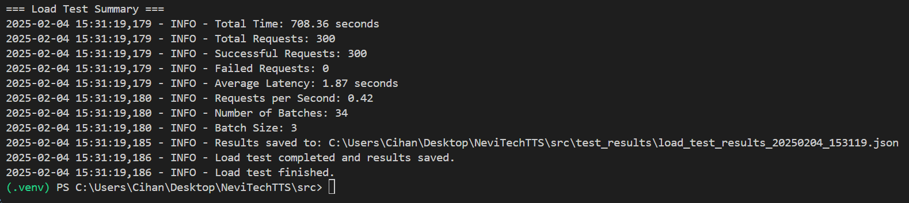

# NeviTechTTS


## Kullanım için gerekenler
1. .env dosyasına eklenmesi gerekenler
   AWS_ACCESS_KEY_ID=<here>
   AWS_SECRET_ACCESS_KEY=<here>

2. certificate_constants.py dosyasında KEY_PATH ve CERT_PATH düzenlenmeli

```bash
pip install -r requirements.txt
pip install torch torchvision torchaudio --index-url https://download.pytorch.org/whl/cu124
python main.py
```

# TODO
- 01.02.25
   - ~~Update kokoro generation code, has its own package now~~
   - ~~Environment variable in translate.py~~
- 02.02.25
   - ~~Update code to use config.yaml~~
   - ~~Special error handlers~~
- 03.02.25
   - ~~Split into services~~
   - ~~Install all models in first go~~
   - ~~Clean audio folder after some time~~
   - ~~Better readme~~
- 04.02.25
   - tests
   - fix polly stops working

- IMPORTANT: venv/src/tts/TTS/utils/io.py line 54: add weights_only=False

# Multi-Engine Text-to-Speech Service

A comprehensive Text-to-Speech (TTS) service that integrates multiple TTS engines including AWS Polly, XTTS, Kokoro, Vietnamese XTTS, and Indic Parler. The service provides a unified API for text-to-speech synthesis across various languages and voices.

# Performance Metrics
Latency by Model Group

Load Test Summary


## Project Structure
```
|-src \
|-- |-- __init__.py
|-- |-api \
|-- |-- |-- __init__.py
|-- |-- |-- routes.py
|-- |-audio \
|-- |-certificates \
|-- |-- |-- My_CA_Bundle.crt
|-- |-- |-- _.klassifier.com.key
|-- |-- |-- combined_certificate.crt
|-- |-- |-- klassifier-translation-322b40f8ffce.json
|-- |-- |-- star_klassifier_com.crt
|-- |-config \
|-- |-- |-- ConfigLoader.py
|-- |-- |-- __init__.py
|-- |-- |-- config.yaml
|-- |-- config.yaml
|-- |-core \
|-- |-- |-- __init__.py
|-- |-- |-- constants.py
|-- |-- |-- error_handlers.py
|-- |-- |-- file_cleanup.py
|-- |-- |-- translator.py
|-- |-- |-- tts_manager.py
|-- |-- |-- voice_info_engine.py
|-- |-- main.py
|-- |-references \
|-- |-- |-- man.wav
|-- |-- |-- woman.wav
|-- |-services \
|-- |-- |-- IndicService.py
|-- |-- |-- KokoroService.py
|-- |-- |-- PollyService.py
|-- |-- |-- ViXttsService.py
|-- |-- |-- XttsService.py
|-- |-- |-- __init__.py
|-- |-- |-- base.py
|-- |-static \
|-- |-- |-- style.css
|-- |-templates \
|-- |-- |-- index.html
|-- |-test_results \
|-- |-tests \
|-- |-- |-- __init__.py
|-- |-- |-- conftest.py
|-- |-- |-- test_error_handlers.py
|-- |-- |-- test_load.py
|-- |-- |-test_services \
|-- |-- |-- |-- __init__.py
|-- |-- |-- |-- test_indic_service.py
|-- |-- |-- |-- test_kokoro_service.py
|-- |-- |-- |-- test_polly_service.py
|-- |-- |-- |-- test_vixtts_service.py
|-- |-- |-- |-- test_xtts_service.py
|-- |-- |-- test_tts_manager.py
|-- |-- |-- voice_test.py
```

## Supported Models and Languages

### XTTS-v2 [Supports voice cloning]
| Language | Code |
|----------|------|
| Arabic | ar |
| Chinese | zh-cn |
| Czech | cs |
| Dutch | nl |
| English | en |
| French | fr |
| German | de |
| Hindi | hi |
| Hungarian | hu |
| Italian | it |
| Japanese | ja |
| Korean | ko |
| Polish | pl |
| Portuguese | pt |
| Russian | ru |
| Spanish | sp |
| Turkish | tr |

### Kokoro [Does not support voice cloning]
| Language | Voice Count | Gender Distribution |
|----------|-------------|-------------------|
| English (US) | 20 | 12 Female, 8 Male |
| English (UK) | 8 | 4 Female, 4 Male |
| Japanese | 5 | 4 Female, 1 Male |
| Chinese | 8 | 4 Female, 4 Male |
| Italian | 2 | 1 Female, 1 Male |
| French | 1 | 1 Female |
| Spanish | 3 | 1 Female, 2 Male |
| Portuguese | 3 | 1 Female, 2 Male |
| Hindi | 4 | 2 Female, 2 Male |

### Indic Parler [Does not support voice cloning]
| Language | Language Code | Voice Count | Gender Distribution |
|----------|--------------|-------------|-------------------|
| Assamese | as | 2 | 1 Female, 1 Male |
| Bengali | bn | 2 | 1 Female, 1 Male |
| Bodo | brx | 2 | 1 Female, 1 Male |
| Chhattisgarhi | hne | 2 | 1 Female, 1 Male |
| Dogri | doi | 1 | 1 Male |
| Gujarati | gu | 2 | 1 Female, 1 Male |
| Hindi | hi | 2 | 1 Female, 1 Male |
| Kannada | kn | 2 | 1 Female, 1 Male |
| Malayalam | ml | 2 | 1 Female, 1 Male |
| Manipuri | mni | 2 | 2 Male |
| Marathi | mr | 2 | 1 Female, 1 Male |
| Nepali | ne | 1 | 1 Female |
| Odia | or | 2 | 1 Female, 1 Male |
| Punjabi | pa | 2 | 1 Female, 1 Male |
| Sanskrit | sa | 1 | 1 Male |
| Tamil | ta | 1 | 1 Female |
| Telugu | te | 2 | 1 Female, 1 Male |

### Vietnamese XTTS [Supports voice cloning]
- Dedicated model for Vietnamese language
- Male and Female voices available
- Neural-based synthesis

### AWS Polly (Neural) [Does not support voice cloning]
| Language | Variants |
|----------|----------|
| Arabic | Standard, Gulf |
| Catalan | Standard |
| Chinese | Cantonese, Mandarin |
| Czech | Standard |
| Danish | Standard |
| Dutch | Standard, Belgian |
| English | US, UK, Australian, Indian, New Zealand, South African, Welsh |
| Finnish | Standard |
| French | Standard, Belgian, Canadian |
| German | Standard, Austrian, Swiss |
| Hindi | Standard |
| Icelandic | Standard |
| Italian | Standard |
| Japanese | Standard |
| Korean | Standard |
| Norwegian | Standard |
| Polish | Standard |
| Portuguese | Brazilian, European |
| Romanian | Standard |
| Russian | Standard |
| Spanish | Spain, Mexican, US |
| Swedish | Standard |
| Turkish | Standard |
| Welsh | Standard |

## Features
- Multi-engine TTS synthesis
- Language detection and translation
- Real-time audio generation
- Automatic file cleanup
- Error handling and logging
- Health monitoring
- REST API
- Web interface


## Setup Requirements
1. Python 3.10.11
2. AWS credentials (for Polly)
3. Google Cloud credentials (for translation)
4. Required Python packages (see requirements.txt)

## Configuration
Configuration is managed through `config.yaml`:
```yaml
models:
  xtts_base_model: "tts_models/multilingual/multi-dataset/xtts_v2"
  xtts_vietnamese: "capleaf/viXTTS"
  indic_model: "ai4bharat/indic-parler-tts-pretrained"

kokoro_speed: 1

directories:
  audio_output_dir: "audio"
  vietnamese_model_dir: "vn_model"

paths:
  key_path: "./.com.key"
  cert_path: "./.crt"
  google_credentials: "./.json"

flask:
  port: 5000
  host: "0.0.0.0"

reference_audio_paths:
  male: "./man.wav"
  female: "./woman.wav"

cleanup:
  max_age_hours: 3
  min_free_space_mb: 1000
  cleanup_interval_minutes: 30
```

## API Endpoints
- `GET /voices` - List available voices
- `POST /generate-realtime` - Generate speech
- `POST /translate` - Translate text
- `GET /health` - Service health check
- `GET /audio/<filename>` - Retrieve generated audio
- `POST /clear-session` - Clear session data
