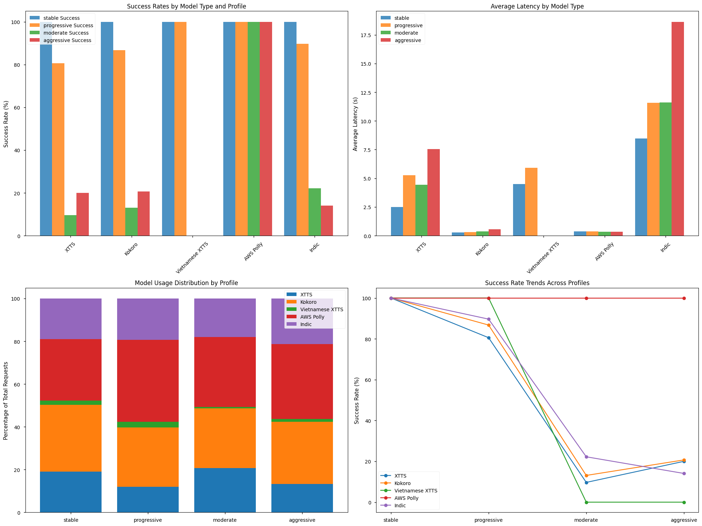

Metin-Konuşma (TTS) Sistemleri Performans Raporu

1. Genel Bakış
Test sürecinde 4 farklı profil (stabil, kademeli, orta ve agresif yük) altında 5 farklı TTS modeli değerlendirilmiştir: XTTS, Kokoro, Vietnam XTTS, AWS Polly ve Indic.

2. Model Bazlı Performans Analizi

AWS Polly:
- Tüm test profillerinde %100 başarı oranı
- En tutarlı performans gösteren model
- Ortalama gecikme süresi 0.35 saniye civarında
- Yük artışından en az etkilenen model

XTTS:
- Stabil profilde %100 başarı
- Yük arttıkça performans düşüşü:
  * Kademeli yükte: %80.6
  * Orta yükte: %9.7
  * Agresif yükte: %20
- Gecikme süreleri 2.5 - 7.5 saniye arasında değişiyor

Kokoro:
- Stabil profilde %100 başarı
- En düşük gecikme sürelerine sahip (0.3 - 0.6 saniye)
- Yük altında başarı oranları:
  * Kademeli: %86.7
  * Orta: %13.1
  * Agresif: %20.7

Indic:
- En yüksek gecikme sürelerine sahip model (8.5 - 18.6 saniye)
- Stabil profilde %100 başarı
- Yük altında ciddi performans düşüşü:
  * Kademeli: %89.7
  * Orta: %22.2
  * Agresif: %14.1

Vietnam XTTS:
- En az test edilen model
- Stabil ve kademeli profillerde %100 başarı
- Orta ve agresif yükte başarısız (%0)

3. Profil Bazlı Değerlendirme

Stabil Profil (0.50 request/second):
- Tüm modeller %100 başarı
- Toplam 300 istekten hepsi başarılı
- Model bazlı gecikme süreleri tutarlı

Kademeli Yük Profili (0.73 request/second):
- AWS Polly dışında tüm modellerde performans düşüşü
- Başarı oranları %80-%100 arasında
- Gecikme süreleri kabul edilebilir seviyelerde

Orta Yük Profili (1.95 request/second):
- AWS Polly dışında ciddi performans düşüşü
- XTTS ve Kokoro'da %15'in altında başarı
- Gecikme sürelerinde artış

Agresif Yük Profili (3.41 request/second):
- En zorlu test senaryosu
- AWS Polly dışında tüm modeller %25'in altında başarı
- En yüksek gecikme süreleri bu profilde gözlemlendi

4. Sonuç ve Öneriler

- AWS Polly, yüksek yük altında bile tutarlı performans göstererek en güvenilir seçenek olarak öne çıkıyor
- Kokoro, düşük gecikme süreleriyle dikkat çekiyor ancak yük altında başarı oranı düşüyor
- XTTS modelleri orta seviye performans gösteriyor
- Indic modeli, yüksek gecikme süreleri nedeniyle optimize edilmeli
- Vietnam XTTS'in daha fazla test edilmesi gerekiyor

Sistemin genel performansını iyileştirmek için:
- Yük dengeleme stratejileri geliştirilmeli
- AWS Polly dışındaki modeller için hata toleransı artırılmalı
- Gecikme sürelerini azaltmak için optimizasyon yapılmalı
- Yedekleme mekanizmaları kurulmalı

## Charts

